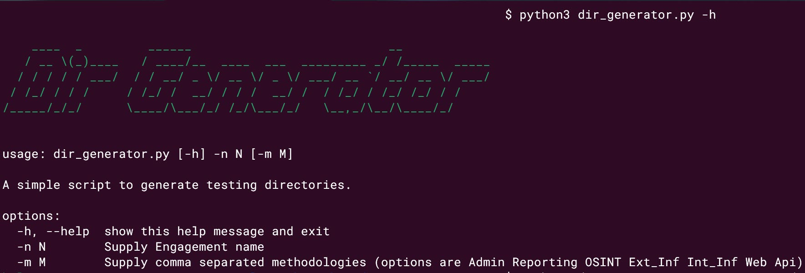
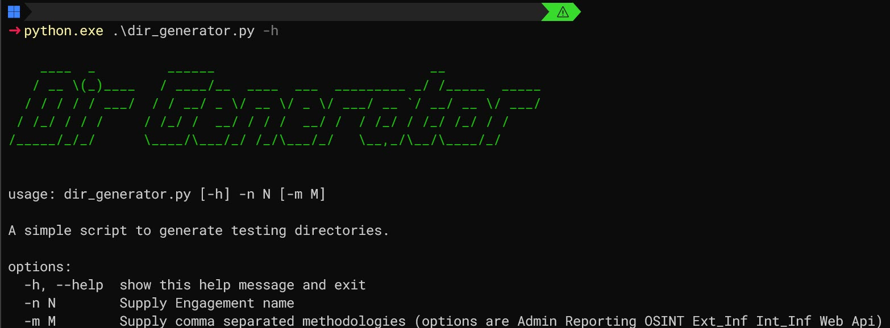
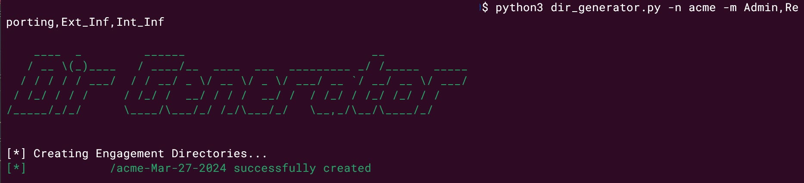
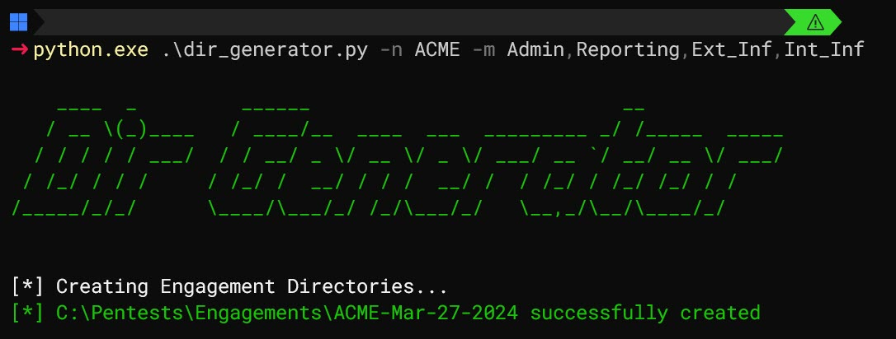
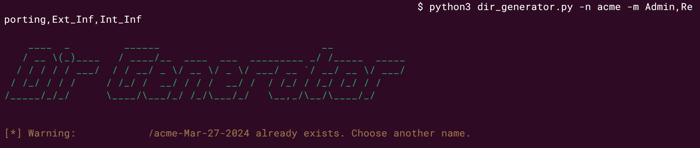
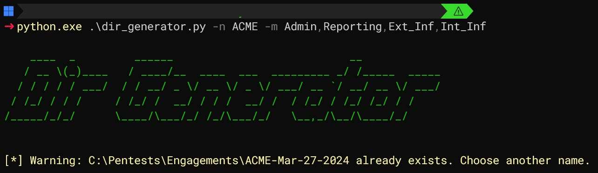

# Dir-Generator.py
- Simple Testing Directory Generator
  - Its not groundbreaking, but helps with organisation of your engagement and saves some time getting set up.
- Works both on Linux & Windows (cross-platform)
---

## Overview:
This Python script is designed to facilitate the creation of testing directories for penetration testing engagements, providing a structured approach to organizing your work. Whether you're a penetration tester, security analyst, or simply organizing your projects, this script streamlines the process of setting up directories for different methodologies within an engagement.

### Key Functions:
- print_banner(): This function displays a colorful ASCII banner when the script is executed, adding a touch of visual appeal to your terminal.

- cli_parser: Utilizes the argparse module to parse command-line arguments. It accepts two optional arguments:

- `-n`: Specifies the engagement name. This argument is required.
- `-m`: Allows you to specify methodologies for the engagement. Methodologies should be provided as a comma-separated list of options. If not specified, the script defaults to using all available methodologies.

### Main Program:

- Directory Creation: Upon parsing the command-line arguments, the script proceeds to create the necessary directory structure.
- Engagement Directory: Creates a root directory for the engagement, named with the provided engagement name and the current date.
- Methodology Directories: Within the engagement directory, subdirectories are created for each specified methodology. If no methodologies are specified, directories for all available methodologies are created.

### Expected Outcome:
Upon execution of the script with the required engagement name (-n) and optional methodology (-m) arguments, the script will generate a directory structure tailored to your testing needs. The root directory will be named based on the engagement name and current date, with subdirectories created for each specified methodology. This organized structure allows for efficient management and navigation of testing resources and results.

## Getting Started:

### Requirements:
```
Python 3.x
argparse module
```

### Usage:

Execute the script with Python 3, specifying the engagement name (-n) and optionally, methodologies (-m).
Example:

1) Copy code/ repo
2) `python3 dir_generator.py -n MyEngagement -m Methodology1,Methodology2`

**Examples for both Linux & Windows:**

**Help Menu**



**Usage**



**Duplication check**




**Notes:**

- Ensure proper permissions to create directories in the desired location.
- Customize directory paths as needed, especially for non-Linux platforms.

**Customization:**
- Modify directory paths within the script to suit your preferred directory structure or platform-specific requirements.
- Extend functionality by adding new methodologies to the directoryDict dictionary in the dir_names.py module.

_**Feedback and Contributions:**
We welcome feedback, suggestions, and contributions to enhance the functionality and usability of this script. Feel free to submit issues or pull requests on the GitHub repository._

Happy testing! 🛡️🔍
